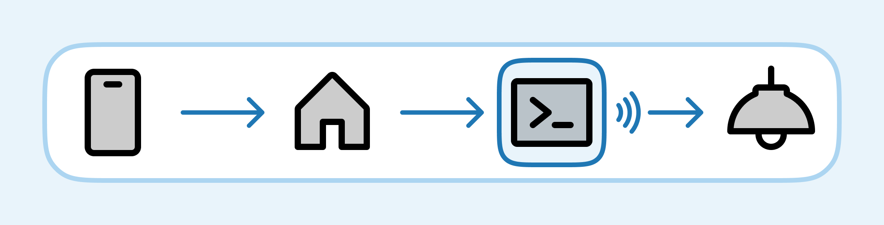
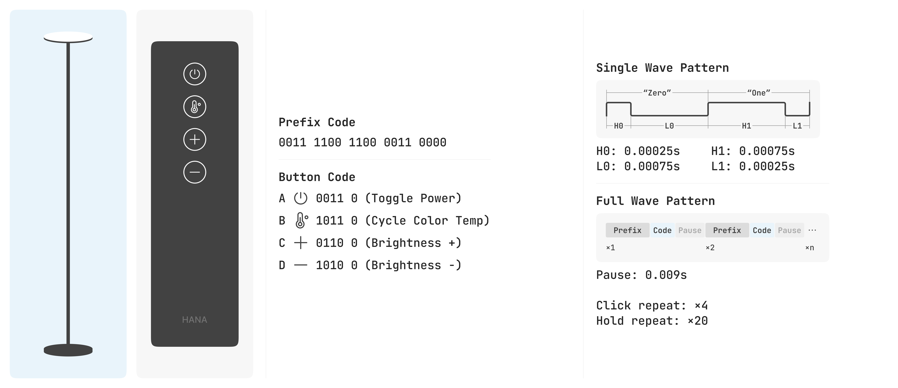
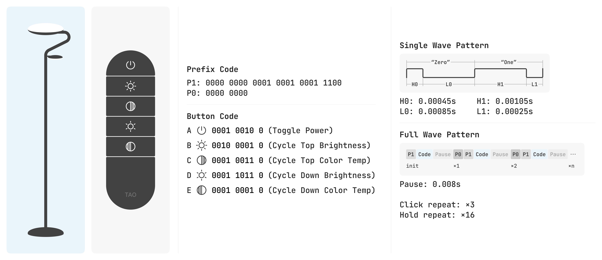
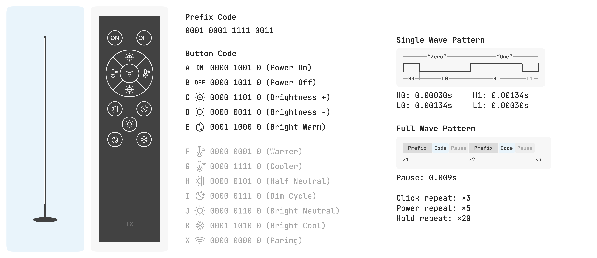

# py-rf-lights

This Python script transforms standard remote-controlled lights to smart lights. You can add these lights to the Apple Home app via [this Homebridge plug-in](https://github.com/xtai/homebridge-rf-lights).

## Features

- Manage multiple lights using a extensible framework.
- Store lights status using JSON files.
- Control the brightness of the entire light or individual components.
- Emulate the remote control.

## Script Usage

### [control.py](https://github.com/xtai/py-rf-lights/blob/main/control.py)

Control power:

- `python control.py --light hana --on`
- `python control.py --light hana --off`

Control brightness:

- `python control.py --light hana --brightness 100`
- `python control.py --light hana --brightness 10`

Control a part of light:

- `python control.py --light tao --part top --on`
- `python control.py --light tao --part top --brightness 50`
- `python control.py --light tao --part top --off`

Sync:

Sometimes a command might not be able to regester due to transimitting issues or interference, this command will re-sync the light status to on and 100% brightness.

- `python control.py --light hana --sync`

### [remote.py](https://github.com/xtai/py-rf-lights/blob/main/remote.py)

Emulate a remote button click:

- `python remote.py --light tao --button a`
- `python remote.py --light hana --button a`

Emulate the default remote button hold:

- `python remote.py --light tao --button b --hold`

Emulate a custom repeat for remote button:

- `python remote.py --light hana --button c --repeat 60`

## How does it work?

### Remote

Some lights are controlled by a remote using radio frequency, often 433 MHz.

### Learn

To emulate the remote, decoding its communication is the first step. This [tutorial](https://www.instructables.com/Super-Simple-Raspberry-Pi-433MHz-Home-Automation/) from [george7378](https://www.gkristiansen.co.uk/) shows how to do this with a Raspberry Pi and a 433 MHz receiver.

Below are three example lights with their remote controller radio wave patterns and button codes decoded.

### Control

After decoding the remote signal, we can replicate the button click. However, to make the light smart, we also need to track its status and integrate a generic interface for smart home frameworks like Homebridge. This means we have to figure out the necessary button clicks according to the light model and its current and target state, then transmit the sequences.

The logic for the example lights below can be found in the `[light_name].py` files within the [light folder](https://github.com/xtai/py-rf-lights/tree/master/light).

### Example Lights

#### Light Hana

Amazon: https://www.amazon.com/dp/B0CDGF12NR/

#### Light Tao

Amazon: https://www.amazon.com/dp/B0CQ7HY8VQ/

#### Light Tx

Amazon: https://www.amazon.com/dp/B08M95NB7B/

## Acknowledgments

- https://github.com/milaq/rpi-rf
- https://www.instructables.com/Super-Simple-Raspberry-Pi-433MHz-Home-Automation/
